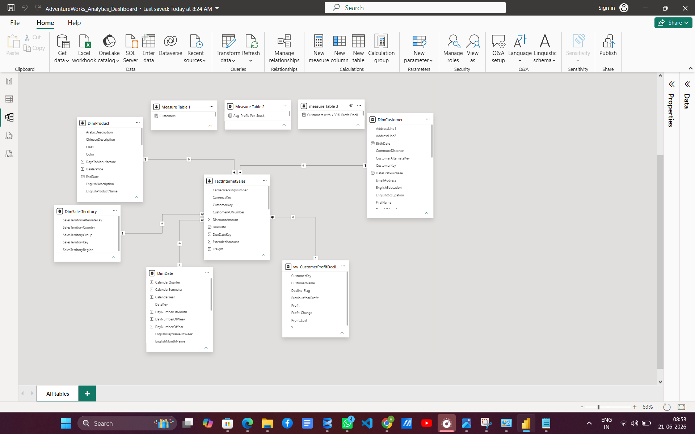
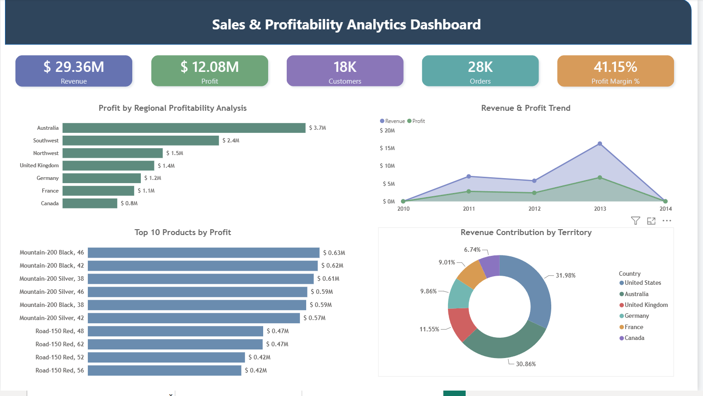
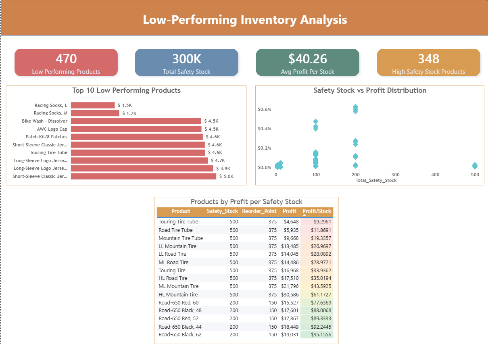
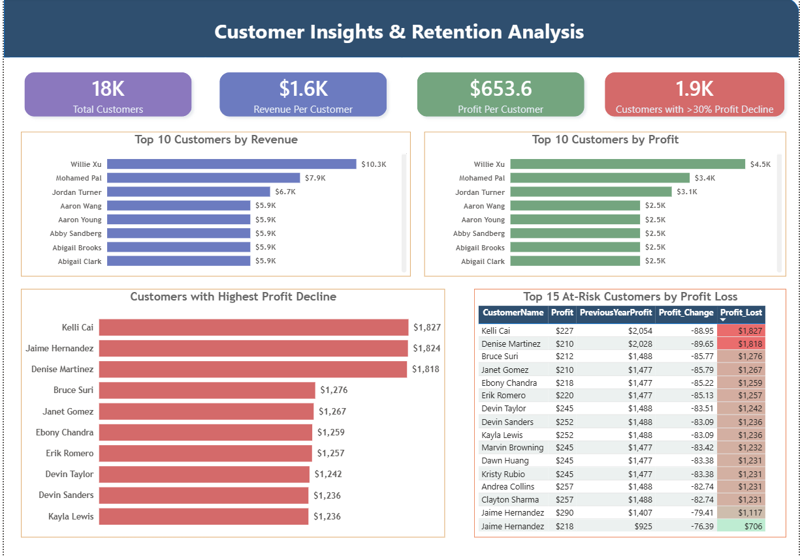

# AdventureWorks Sales Analytics Dashboard

## Project Overview
This project analyzes sales performance, inventory efficiency, and customer profitability using SQL Server and Power BI.

## Tools Used
- SQL Server
- Power BI
- DAX
- Power Query

## Dashboard Pages

### 1. Sales & Profitability Analytics
- Revenue Analysis
- Profit Analysis
- Regional Profitability
- Revenue Trend
- Top Products by Profit

### 2. Low-Performing Inventory Analysis
- Low Performing Products
- Safety Stock Analysis
- Inventory Efficiency
- Profit per Safety Stock

### 3. Customer Insights & Retention Analysis
- Top Customers by Revenue
- Top Customers by Profit
- Customers with >30% Profit Decline
- At-Risk Customers Analysis

## Data Model

## SQL Analysis
All SQL queries are available in:
Sql/Business_Queries.sql

## Dashboard Screenshots

## Sales & Profitability Analytics

## Low-Performing Inventory Analysis

## Customer Insights & Retention Analysis

